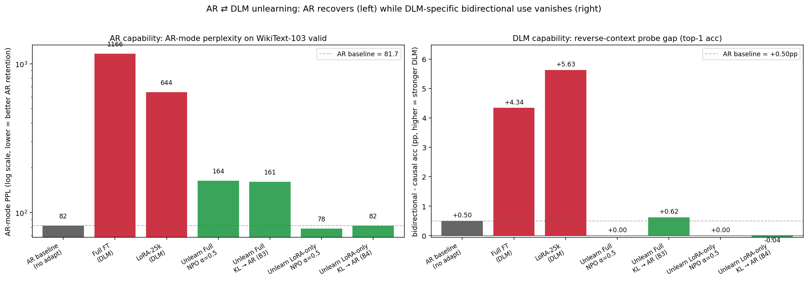
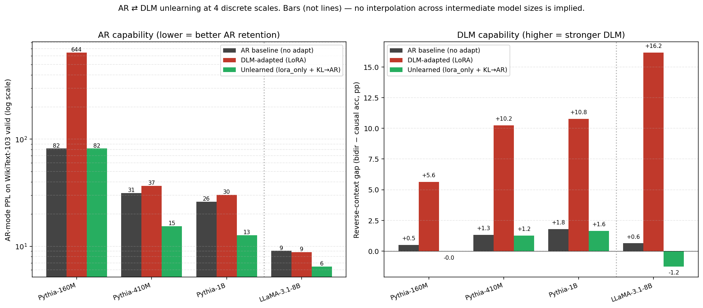
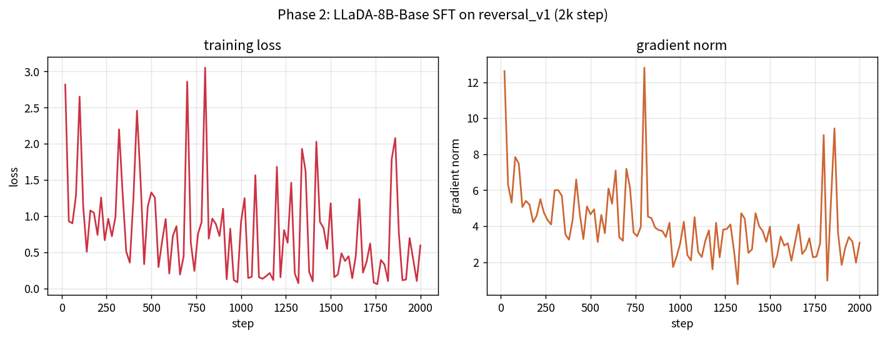
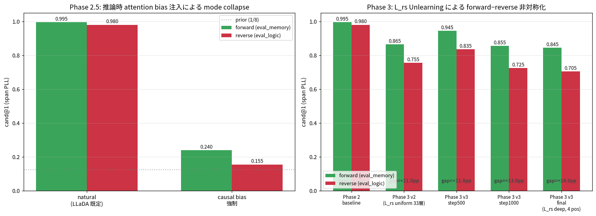
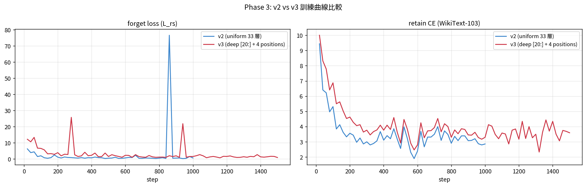
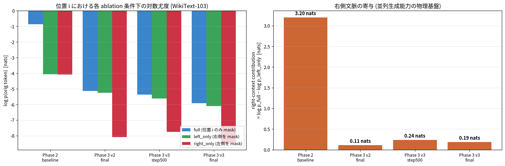
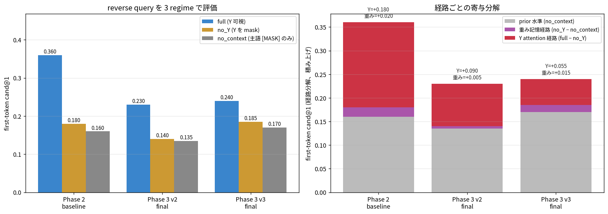

# 拡散言語モデルから自己回帰モデルへのアンラーニングによる逆変換

本リポジトリは、**拡散言語モデル**（DLM）を**自己回帰モデル**（AR）の挙動に戻せるかという問いを検討した研究の実装と結果を収録する。
手段はアーキテクチャの変更を伴わない**アンラーニング**のみである。

## 研究の問い

既存研究（Gong et al. 2024 [3]）は「AR」から「DLM」への変換を追加学習やアーキテクチャ拡張で実現してきた。
本研究は逆向きの問いを扱う。
すでに「DLM」化されたモデルから、勾配計算と既存パラメータの選択的更新のみで「AR」の挙動を復元できるか。

この問いの解明には二つの意義がある。

1. 「DLM」が獲得した双方向参照能力を支える内部表現を、機構的に分析する介入手段を与える。
2. 同一の重みが「AR」モードと「DLM」モードを行き来できるかを検証し、両モードの差異をアーキテクチャと表現のどちらに帰属させるかを切り分ける。

## 既存研究との対比

| 方向 | 代表研究 | 手段 |
|---|---|---|
| AR → DLM | Gong et al. 2024 [3] 等 | 追加学習、双方向アテンション化、MDM 損失導入 |
| DLM → AR（本研究） | （本研究） | 勾配計算による「アンラーニング」のみ、アーキテクチャ非改変 |

表1: 既存研究と本研究の対比

## 実験設計

研究は段階的に組み立てた。
各 Phase は前 Phase の結果を踏まえて目的を更新する。

### Phase 1、自己回帰ベースラインと五軸評価

最初に「AR」モデル（Pythia-160M, 410M, 1B）を双方向アテンション化と MDM 損失で「DLM」化し、「アンラーニング」により「AR」挙動を復元できるか検証した。
同時に「AR」モードと「DLM」モードを公平に評価する**五軸評価フレームワーク**を確立した。

「五軸評価」の構成を以下に示す。

| 観点 | 計測内容 |
|---|---|
| AR 性能 | 強制因果マスク下の next-token perplexity |
| DLM 性能 | 強制双方向下の MDM NELBO |
| Reverse-context probe（因果） | 先頭 5 トークンをマスクし、因果モードで top-1 復元精度を計測 |
| Reverse-context probe（双方向） | 先頭 5 トークンをマスクし、双方向モードで top-1 復元精度を計測 |
| Reverse gap | 因果プローブと双方向プローブの差。「DLM」固有の双方向参照能力の指標 |

表2: 「五軸評価」の構成

主結果（Pythia-160M, B4 構成: lora_only + KL-to-AR + α=0.5）を示す。

| 指標 | AR baseline | DLM-adapted | Unlearned (B4) |
|---|---|---|---|
| AR Perplexity | 81.7 | 644 | 81.7 |
| DLM NELBO | 19.2 | 10.18 | 16.15 |
| Reverse causal acc | 0.16% | 1.09% | 1.09% |
| Reverse bidir acc | 0.66% | 6.72% | 1.05% |
| Reverse gap | +0.50 pp | +5.63 pp | -0.04 pp |

表3: Phase 1 の主結果（Pythia-160M, B4 構成）



図1: Phase 1 「五軸評価」サマリ

Pythia-160M を一旦「DLM」化した後、勾配計算のみで「AR」ベースラインと統計的に区別できない水準まで復元できた。
同型の現象は Pythia-410M, Pythia-1B, LLaMA-3.1-8B でも確認している。



図2: モデル規模によるスケーリングの傾向

### Phase 2、ネイティブ拡散言語モデルへの拡張

Phase 1 は自分で「DLM」化した「AR」モデルを「AR」に戻す実験であり、対象モデルが本来「AR」由来である点で予備的であった。
Phase 2 では、はじめから「DLM」として事前学習された LLaDA-8B-Base（Nie et al. 2025 [4]）を対象とし、より厳密な検証に進んだ。

評価には **reversal_v1** データセットを用いる。
500 個の架空エンティティ対を生成し、順方向と逆方向の cand@1 を測定する。
架空エンティティを用いる理由は、事前学習データに存在しない関係を新規に学習させ、データリークの影響を排除するためである。

Phase 2 の SFT 後の挙動を以下に示す。

| 評価 | LLaDA-8B-Base（Phase 2 SFT 後） | Pythia-160M AR（同データ SFT 後） |
|---|---|---|
| forward cand@1 | 0.995 | 0.91 |
| reverse cand@1 | 0.980 | 0.16 |
| forward−reverse gap | +1.5 pp | +75 pp |

表4: Phase 2 SFT 後の forward/reverse cand@1 比較

LLaDA は順方向と逆方向で対称な性能を示し、**逆転呪い**（reversal curse, Berglund et al. 2023 [1]）を持たない。
「AR」である Pythia-160M は典型的な逆方向の劣化を示す。
LLaDA と Pythia-160M の順逆差は +73.5 pp であり、「アンラーニング」が削減を試みる対象である。



図3: Phase 2 LLaDA SFT 訓練曲線

### Phase 2.5、推論時の因果バイアス注入

「アンラーニング」に進む前に、LLaDA の推論時アテンションバイアスとして因果マスクを強制した場合の挙動を確認した。
この操作は LLaDA の重みを変えずに「AR」風アテンションで動かすものであり、「アンラーニング」の上限線として参照できる。

| モード | forward cand@1 | reverse cand@1 |
|---|---|---|
| natural（LLaDA 既定） | 0.995 | 0.980 |
| 因果バイアス強制 | 0.240 | 0.155 |

表5: Phase 2.5 推論時因果バイアス注入の結果

結果はモード崩壊であった。
同一の重みのままアテンションだけを因果的にする操作では「AR」化は達成されない。
LLaDA は推論時の双方向アテンションを前提に重みを学習しており、アテンション構造を切り替えるだけでは出力分布全体が崩壊する。
この結果は、「アンラーニング」がアテンション構造を維持したまま重みを「AR」寄りに調整する必要があることを示唆した。

### Phase 3 v2、残差ストリーム右側文脈不変性損失

機構解釈の文献に基づき、「DLM」の双方向参照能力は各層の**残差ストリーム**に右側文脈情報が統合されて流れる挙動として現れるという仮説を立てた。
この仮説から、自己蒸留型の損失 **L_rs** を導入した。

「L_rs」は、入力位置 i における左側のみ可視の入力と全文脈可視の入力について、各層の隠れ状態が一致するように全文脈側を引き寄せる平均二乗誤差である。

```
L_rs = Σ_layer || h_layer^full(i) − h_layer^left_masked(i) ||² / N
```

この損失関数を αL_rs + (1-α)·CE の形で AdamW8bit により 1000 ステップ最小化する。
保持損失は WikiText-103 上の因果的 next-token CE であり、一般的な言語能力の維持を担う。

Phase 3 v2 の結果（LLaDA-8B-Base, 「reversal_v1」評価）を示す。

| 評価 | Phase 2 | Phase 3 v2 |
|---|---|---|
| forward cand@1 (eval_memory) | 0.995 | 0.865 |
| reverse cand@1 (eval_logic) | 0.980 | 0.755 |
| forward−reverse gap | +1.5 pp | +11.0 pp |

表6: Phase 3 v2 の結果（「L_rs」、全層一様平均）

Pythia-160M 「AR」の参照点（+73.5 pp）には届かないが、勾配計算のみで逆方向側を選択的に劣化させ、順逆の非対称性を生じさせることに成功した。

### Phase 3 v3、層スライスとマルチポジション化

Transformer の階層別機能分業に関する先行研究（Tenney et al. 2019 [5], Clark et al. 2019 [2]）は、表層的な構文処理が浅層に、意味的統合が深層に局在することを示している。
本研究の予備観察でも、LLaDA の双方向情報統合は第 20 層から第 32 層までの深層に集中する傾向が認められた。
Phase 3 v2 は 33 個の隠れ状態を一様平均しており、深層への勾配が約四割に希釈されていた可能性がある。
Phase 3 v3 では以下の二点を改良した。

1. **層スライス**：「L_rs」を hidden_states[20:] のみに制限する。
2. **マルチポジション**：バッチごとに 4 個の位置 i を一様にサンプリングして平均する。全文脈の順伝播は共有し、左側マスク順伝播のみ勾配なしで 4 回実行する。

Phase 3 v3 の結果を示す。

| 評価 | Phase 2 | Phase 3 v2 | Phase 3 v3 |
|---|---|---|---|
| forward cand@1 | 0.995 | 0.865 | 0.845 |
| reverse cand@1 | 0.980 | 0.755 | 0.705 |
| forward−reverse gap | +1.5 pp | +11.0 pp | +14.0 pp |

表7: Phase 3 v3 の結果（「層スライス」と「マルチポジション」の適用後）



図4: Phase 2.5 のモード崩壊と Phase 3 の進行

順逆差は v2 より拡大したが、順方向側の劣化も同時に進行している。
v2 と v3 の訓練曲線を比較すると、v3 は深層に勾配を集中させることで忘却損失が断続的にスパイクしやすく、保持 CE もやや高水準で推移する。



図5: Phase 3 v2 と v3 の訓練曲線比較

## 二重経路の分析

Phase 3 の結果から、「DLM」の右側文脈参照能力は**アテンション経路**と**重み記憶経路**という少なくとも二つの独立した経路で実現されていることが示された。
「L_rs」の最小化は「アテンション経路」を選択的に削減できる。
この知見を以下の二つの追加実験で確認した。

### 右側文脈寄与の定量化

WikiText-103 の検証分割上で、各位置 i の元トークンを三つの文脈除去条件下で予測した。

- **full**：位置 i のみマスク
- **left_only**：位置 [i, seq) をマスクし、「AR」等価の左側文脈のみを使用
- **right_only**：位置 [0, i] をマスクし、右側文脈のみを使用

右側文脈の寄与を log p(full) − log p(left_only) で定義する。
この指標は、位置 i でのトークン予測において右側文脈が左側文脈に対してどれだけの追加情報を与えているかを nats 単位で測る。

| チェックポイント | 右側文脈寄与（nats） |
|---|---|
| Phase 2（双方向事実微調整済み LLaDA） | 3.20 |
| Phase 3 v3 最終（「L_rs」適用後） | 0.19 |

表8: 右側文脈寄与の比較

右側文脈の寄与が約 94% 削減された。
この削減は、並列トークン生成能力の物理基盤である右側マスク位置からの情報還流が実質的に消失したことを意味する。



図6: 右側文脈寄与の変化

### 記憶経路とアテンション経路の分離

逆方向クエリ "[MASK] is paired with Y." について、入力を三つの除去条件に分けて評価した。

- **full**：通常入力（先頭 [MASK] と Y の両方が可視）
- **no_Y**：先頭 [MASK] は保持し、Y のスパンをマスクで置換
- **no_context**：先頭 [MASK] のみで、右側をすべて削除

full と no_Y の差分は Y への「アテンション経路」の寄与を、no_Y と no_context の差分は「重み記憶経路」の寄与をそれぞれ定量化する。

| 経路 | Phase 2 寄与 | Phase 3 v3 寄与 | 削減率 |
|---|---|---|---|
| Y アテンション経路（full − no_Y） | +0.18 | +0.055 | 約 70% |
| no_Y 水準（重み記憶 + 事前分布） | 0.18 | 0.185 | ほぼ変化なし |

表9: 記憶経路とアテンション経路の寄与分解

先頭トークンの cand@1 では、Y を可視にしたときの上昇分が「アテンション経路」に、Y をマスクしても残る予測精度が重みベースの寄与に対応する。
「L_rs」は Y への「アテンション経路」を約 70% 削減した一方、「重み記憶経路」の水準はほぼ動いていない。
スパン単位の逆方向 cand@1 が 0.705 と高水準にとどまる事実は、主体名 X 全体の重み記憶が「L_rs」では削減されないことを意味する。
「L_rs」は「アテンション経路」（Y → X）を主に削減し、X の固有名詞自体の重み記憶は無傷で残す。
この結果により、二重経路像が確認された。



図7: 記憶経路とアテンション経路の分解

## 限界

本研究は「L_rs」による右側文脈「アテンション経路」の選択的削減を示したが、以下の限界がある。

1. **完全な「AR」復元には至らない**。Phase 3 v3 の +14 pp は「AR」参照点 +73.5 pp の約二割であり、順逆の非対称性は部分的にしか再現されない。
2. **順方向側の副次的劣化が生じる**。順方向 cand@1 が 0.995 から 0.845 に劣化した。log p(full) は Phase 2 の -0.86 から v3 では -5.91 まで下がり、left_only でも Phase 2 ベースラインの -4.06 を下回る。左側文脈のみで予測する能力自体が同時に弱まっている。
3. **「重み記憶経路」の「アンラーニング」は未達である**。「L_rs」は「アテンション経路」を削減するが、重みに焼き込まれた逆方向関係は残る。「逆転呪い」の機構解明には別の介入が必要である。
4. **実応用との接続が不明瞭である**。右側文脈参照を消す操作の実用的価値は明確でない。勾配計算による経路選択的削減の知見は後続研究の出発点として保持する。

## コード構成

```
src/unlearning_architecture/
    adapt.py            # AR → DLM 適応（双方向アテンション化、MDM 損失）
    unlearn.py          # DLM → AR アンラーニング（selector × forget_loss）
    eval.py             # 五軸評価の中核
    data.py             # WikiText-103 / 合成関係データのストリーミングローダー
    native_dlm.py       # LLaDA 等のネイティブ DLM ロード補助

scripts/
    verify_adapt.py                    # 実装検証ハーネス
    make_reversal_v1_dataset.py        # data/reversal_v1/ の生成
    reverse_probe.py                   # 五軸の逆方向プローブ
    relational_bidir_probe.py          # スパン擬似対数尤度ベースの reversal_v1 評価
    parallel_gen_probe.py              # 右側文脈寄与の定量化
    reversal_memorization_probe.py     # 記憶経路とアテンション経路の分離
    phase25_llada_causal_probe.py      # 推論時因果バイアス注入実験
    phase3_path_viz.py                 # Phase 2.5/3 の結果集約可視化
    wandb_curves_viz.py                # wandb から主要実行の訓練曲線を取得
    summary_viz.py                     # Phase 1 五軸評価サマリ図の生成
    scaling_viz.py                     # Phase 1 スケーリング図の生成

data/
    reversal_v1/        # 500 の架空エンティティ対からなる順方向/逆方向評価データ

figs/                   # 本文書に埋め込まれた可視化結果
```

## 環境

- Python ≥3.12、依存管理は uv
- PyTorch 2.11.0+cu130
- GPU: NVIDIA RTX PRO 6000 Blackwell Max-Q × 7
- 主要モデル: Pythia 160M/410M/1B, LLaMA-3.1-8B, LLaDA-8B-Base
- 評価データ: WikiText-103 および自作の合成データセット reversal_v1
- 実験管理: Weights & Biases (udon0729-shizuoka-university/unlearning-architecture)

## 再現方法

代表的なコマンド例を示す。
GPU は CUDA_VISIBLE_DEVICES で個別に指定し、長時間の実行は nohup で起動する。

```bash
# 実装検証（実装変更後に必ず実行）
CUDA_VISIBLE_DEVICES=4 uv run python scripts/verify_adapt.py

# Phase 1: AR → DLM 適応（Pythia 系の例）
CUDA_VISIBLE_DEVICES=2 nohup uv run python -m unlearning_architecture.adapt \
  --model EleutherAI/pythia-410m \
  --steps 15000 --batch_size 16 --seq_len 512 --lr 3e-4 --warmup 600 \
  --use_lora --lora_r 16 --lora_alpha 32 \
  --out checkpoints/dlm-pythia410m-lora-15k \
  > logs/adapt_pythia410m_lora.log 2>&1 &

# Phase 1: DLM → AR アンラーニング（B4 構成: lora_only + KL→AR）
CUDA_VISIBLE_DEVICES=5 nohup uv run python -m unlearning_architecture.unlearn \
  --adapted_ckpt checkpoints/dlm-pythia410m-lora-15k \
  --selector lora_only --ar_base EleutherAI/pythia-410m \
  --steps 2000 --warmup 200 --lr 5e-5 --alpha 0.5 --forget_loss kl_to_ar \
  --out checkpoints/unlearn-pythia410m-loraonly-kl-2k \
  > logs/unlearn_pythia410m_kl_2k.log 2>&1 &

# Phase 3 v3: LLaDA への L_rs アンラーニング
CUDA_VISIBLE_DEVICES=6 nohup uv run python -m unlearning_architecture.unlearn \
  --adapted_ckpt checkpoints/dlm-llada-reversal-2k \
  --selector delta_topk --top_pct 0.10 --ar_base GSAI-ML/LLaDA-8B-Base \
  --forget_loss right_context_invariance --native_dlm \
  --lrs_layer_start 20 --lrs_n_positions 4 \
  --alpha 0.7 --lr 3e-5 --steps 1500 --warmup 100 \
  --batch_size 2 --seq_len 256 --use_8bit_optim \
  --out checkpoints/unlearn-llada-reversal-lrs-v3-1500 \
  > logs/unlearn_llada_v3.log 2>&1 &

# 五軸評価
CUDA_VISIBLE_DEVICES=4 uv run python -m unlearning_architecture.eval --ckpt <ckpt>
CUDA_VISIBLE_DEVICES=4 uv run python scripts/reverse_probe.py --ckpt <ckpt>

# Phase 3 の追加診断
CUDA_VISIBLE_DEVICES=4 uv run python scripts/parallel_gen_probe.py \
  --ckpt v2=checkpoints/dlm-llada-reversal-2k \
  --ckpt v3=checkpoints/unlearn-llada-reversal-lrs-v3-1500
CUDA_VISIBLE_DEVICES=4 uv run python scripts/reversal_memorization_probe.py \
  --ckpt v2=checkpoints/dlm-llada-reversal-2k \
  --ckpt v3=checkpoints/unlearn-llada-reversal-lrs-v3-1500

# 可視化（results/*.jsonl と wandb から figs/*.png を生成）
uv run python scripts/phase3_path_viz.py
uv run python scripts/wandb_curves_viz.py
```

## 補足図

### wandb からの訓練曲線

各 Phase の主要な実行について、損失、忘却損失、保持損失、勾配ノルムの推移を wandb から取得した図を figs/ に保存している。

- [figs/wandb_p1_dlm_lora25k.png](figs/wandb_p1_dlm_lora25k.png): Phase 1 の「DLM」化訓練（Pythia-160M, LoRA, 25000 ステップ）
- [figs/wandb_p1_unlearn_b4.png](figs/wandb_p1_unlearn_b4.png): Phase 1 「アンラーニング」B4 構成の損失推移
- [figs/wandb_p2_llada_sft.png](figs/wandb_p2_llada_sft.png): Phase 2 LLaDA-8B-Base の「reversal_v1」SFT（2000 ステップ）
- [figs/wandb_p3v2_lrs.png](figs/wandb_p3v2_lrs.png): Phase 3 v2 の「L_rs」アンラーニング（全 33 隠れ状態の一様平均）
- [figs/wandb_p3v3_deep.png](figs/wandb_p3v3_deep.png): Phase 3 v3 の「L_rs」アンラーニング（深層スライス、4 位置平均）
- [figs/wandb_phase3_compare.png](figs/wandb_phase3_compare.png): v2 と v3 の忘却損失と保持損失の直接比較

## 参考文献

[1] Berglund, L., Tong, M., Kaufmann, M., Balesni, M., Cooper Stickland, A., Korbak, T., & Evans, O. (2023). *The Reversal Curse: LLMs trained on "A is B" fail to learn "B is A"*. arXiv:2309.12288.

[2] Clark, K., Khandelwal, U., Levy, O., & Manning, C. D. (2019). *What Does BERT Look At? An Analysis of BERT's Attention*. Proceedings of the 2019 ACL Workshop BlackboxNLP. arXiv:1906.04341.

[3] Gong, S., Agarwal, S., Zhang, Y., Ye, J., Zheng, L., Li, M., An, C., Zhao, P., Bi, W., Han, J., Peng, H., & Kong, L. (2024). *Scaling Diffusion Language Models via Adaptation from Autoregressive Models*. arXiv:2410.17891.

[4] Nie, S., Zhu, F., You, Z., Zhang, X., Ou, J., Hu, J., Zhou, J., Lin, Y., Wen, J.-R., & Li, C. (2025). *Large Language Diffusion Models* (LLaDA). arXiv:2502.09992.

[5] Tenney, I., Das, D., & Pavlick, E. (2019). *BERT Rediscovers the Classical NLP Pipeline*. Proceedings of ACL 2019. arXiv:1905.05950.
